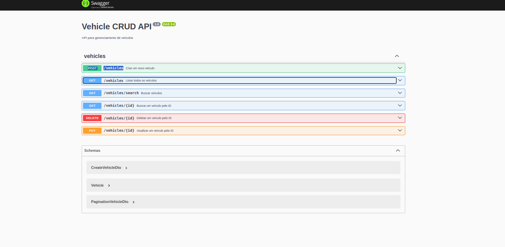
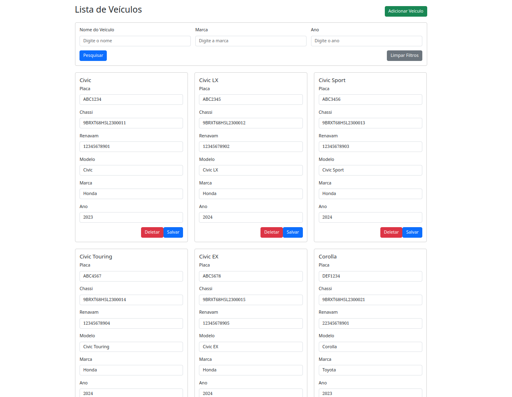

# Vehicle Crud
Projeto demonstrando o uso de NestJS para criar uma API RESTful de CRUD de veículos combinado com MongoDB e Angular para o frontend.

# Visão geral:

### Backend

### Frontend

### Demo
<video controls>
  <source src="./docs/video/demo.mp4" type="video/mp4">
</video>
[link do video caso o componente acima não renderize](https://github.com/this-rafael/vehicle-crud/raw/refs/heads/develop/docs/video/demo.mp4)

## Documentação especifica

### Backend
Consulte o [README.md](./vehicle-backend/README.md) para mais informações sobre o backend.

### Frontend
Consulte o [README.md](./vehicle-frontend/README.md) para mais informações sobre o frontend.
